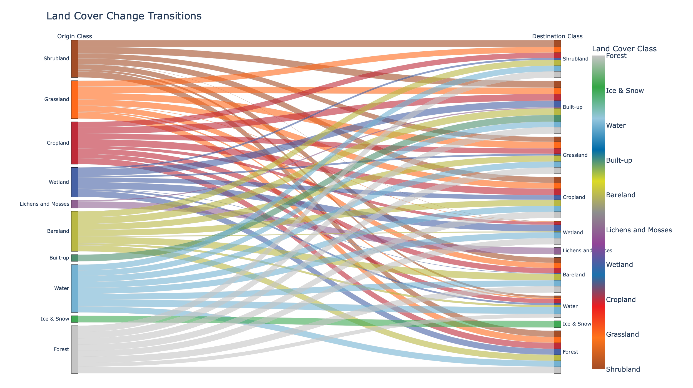

# Forest Cover Change Analysis in the Mediterranean Basin

[](https://opensource.org/licenses/MIT)
[](https://www.python.org/)
[](https://grass.osgeo.org/)

This repository contains the computational workflow for analyzing multi-temporal forest cover changes in the Mediterranean region using ESA CCI and GLC_FCS30D datasets, implemented through GRASS GIS and Python in Jupyter notebooks.

## 📌 Project Overview

- **Objective**: Quantify and visualize forest cover dynamics (1992-2020)
- **Datasets**:
  - ESA Climate Change Initiative (CCI) Land Cover
  - GLC_FCS30D Annual Global Land Cover Maps
- **Study Area**: Mediterranean basin (Lat: 28°-46°N, Lon: 10°W-36°E)
- **Methodology**: Transition matrix analysis, Change detection metrics, Spatial pattern analysis


## Reprojected 2018 Land Cover Map


## 🛠️ Technical Setup

### Prerequisites
- Conda/Mamba package manager
- GRASS GIS 8.4+
- Python 3.8+

### Installation
```bash
# Clone repository
git clone  https://github.com/zafariabbas68/Mediterranean-forest-cover-change
cd mediterranean-forest-cover-change

## GRASS GIS Configuration

Make sure GRASS GIS is installed from the official binary:

- macOS: `/Applications/GRASS-8.4.app/...`

Before using the notebooks, export the following in your terminal:

```bash
export GISBASE="/Applications/GRASS-8.4.app/Contents/Resources"
export PATH="$GISBASE/bin:$GISBASE/scripts:$PATH"
export PYTHONPATH="$GISBASE/etc/python:$PYTHONPATH"
export GISDBASE="$HOME/grassdata"
export LOCATION_NAME="my_location"
export MAPSET="PERMANENT"
export GRASS_PYTHON=python3
export GRASS_SKIP_MAPSET_OWNER_CHECK=1


echo "GRASS GIS environment is ready"
```

2. **Make it executable**:
```bash
chmod +x scripts/activate_grass.sh
```

3. **Create a Python version (`grass_env.py`) for use in Jupyter notebooks**:
```python
import os
import subprocess

def setup_grass():
    """Setup GRASS GIS environment variables"""
    os.environ['GISBASE'] = "/Applications/GRASS-8.4.app/Contents/Resources"
    os.environ['PATH'] = f"{os.environ['GISBASE']}/bin:{os.environ['GISBASE']}/scripts:{os.environ['PATH']}"
    os.environ['PYTHONPATH'] = f"{os.environ['GISBASE']}/etc/python:{os.environ['PYTHONPATH']}"
    os.environ['GISDBASE'] = os.path.expanduser("~/grassdata")
    os.environ['LOCATION_NAME'] = "mediterranean"
    os.environ['MAPSET'] = "PERMANENT"
    os.environ['GRASS_PYTHON'] = "python3"
    os.environ['GRASS_SKIP_MAPSET_OWNER_CHECK'] = "1"
    
    # Test the setup
    try:
        import grass.script as gs
        print(gs.read_command('g.version'))
    except Exception as e:
        print(f"GRASS setup failed: {str(e)}")

if __name__ == "__main__":
    setup_grass()
```

### How to Use This:

1. **From terminal**:
```bash
source scripts/activate_grass.sh
```

2. **In Jupyter notebooks**:
```python
from grass_env import setup_grass
setup_grass()

# Now you can use GRASS Python bindings
import grass.script as gs
gs.run_command('g.list', type='raster')

## GRASS GIS Setup

1. Activate the environment:
```bash
conda activate Geogis
source scripts/activate_grass.sh
```

2. For Jupyter notebooks:
```python
from scripts.grass_env import setup_grass
setup_grass()
```


## 📂 Repository Structure
```
.
├── notebooks/           # Analysis workflows
│   ├── 01_data_preprocessing.ipynb
│   ├── 02_change_detection.ipynb
│   └── 03_visualization.ipynb
├── scripts/             # Reusable modules
│   ├── grass_utils.py   # GRASS GIS helpers
│   └── change_metrics.py
├── data/                # Input datasets (git-ignored)
├── results/             # Outputs (git-ignored)
└── environment.yml      # Conda environment
```

## 🚀 Workflow
1. **Preprocessing**:
   - Dataset harmonization (300m → 30m resolution)
   - Mediterranean basin masking
2. **Change Analysis**:
   ```python
   import grass.script as gs
   from scripts.change_metrics import compute_transition_matrix
   
   compute_transition_matrix(1992, 2020, 'forest')
   ```
3. **Visualization**:
   - Sankey diagrams of land cover transitions
   - Persistence of Land Cover Classes Over Time

# Land Cover Change Project

## Land Cover Change Transition



## Persistence of Land Cover Classes Over Time


## 🤝 How to Cite
If you use this code in your research, please cite:
```
Ghulam Abbas Zafari (2025). Forest Cover Change Analysis in Mediterranean.  https://github.com/zafariabbas68/Mediterranean-forest-cover-change
```

## 📜 License
MIT License - See [LICENSE](LICENSE) for details.

## 🆘 Support
For technical issues, contact to this Add:
ghulamabbas.zafari@mail.polimi.it
