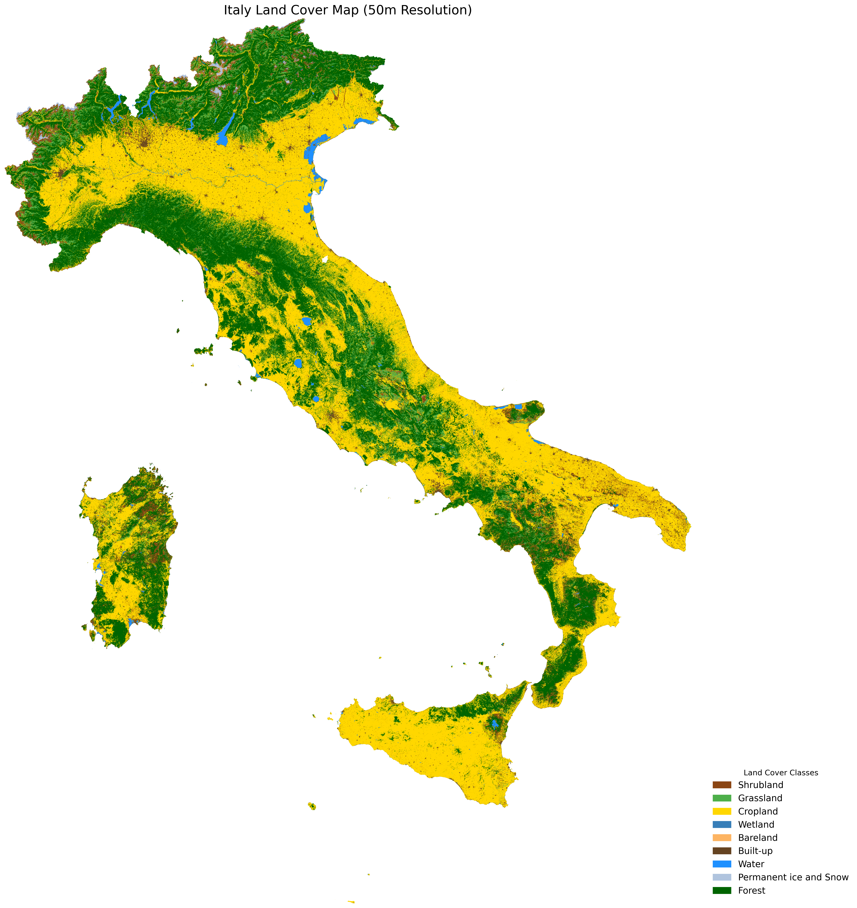
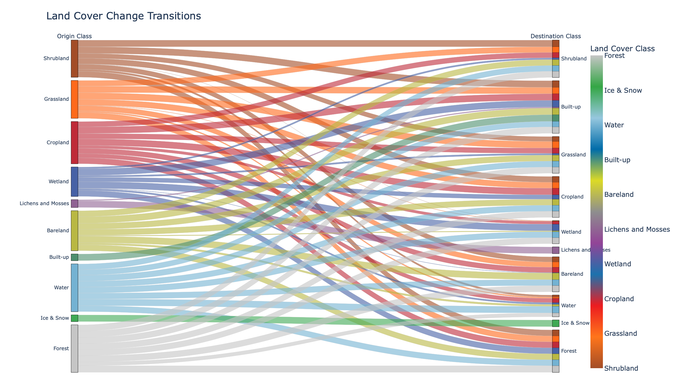

# Land Cover Change Analysis in Italy (1985-2022)

[](https://opensource.org/licenses/MIT)
[](https://www.python.org/)
[](https://grass.osgeo.org/)

This repository contains a comprehensive computational workflow for analyzing multi-temporal land cover changes in Italy using ESA CCI and GLC_FCS30D datasets, implemented through GRASS GIS and Python in Jupyter notebooks. The methodology follows established protocols for land cover change analysis [Olofsson et al., 2014].

## 📌 Project Overview

- **Objective**: Quantify and visualize land cover dynamics and transitions in Italy (1985-2022) with future projections to 2032
- **Primary Analysis**: Forest cover change analysis in the Mediterranean basin
- **Datasets**:
  - ESA Climate Change Initiative (CCI) Land Cover (1992-2022)
  - GLC_FCS30D Annual Global Land Cover Maps (1985-2022)
- **Study Areas**: 
  - Italy (primary focus)
  - Mediterranean basin (Lat: 28°-46°N, Lon: 10°W-36°E)
- **Methodology**: Transition matrix analysis, change detection metrics, spatial pattern analysis, and constrained Markov Chain forecasting

## 🔬 Methodological Framework

### Data Preprocessing
The workflow follows a systematic approach to ensure consistency and accuracy in land cover change analysis:

1. **Data Acquisition**: Land cover datasets from ESA CCI (1992-2022) and GLC_FCS30D (1985-2022)
2. **Spatial Clipping**: Datasets clipped to Italy's geographical extent using QGIS and Python
3. **Reprojection**: All raster layers reprojected to EPSG:3035 (ETRS89-extended / LAEA Europe) for metric area calculations
4. **Land Cover Reclassification**: Original classes harmonized into standardized MOLCA categories
5. **Co-registration and Resampling**: Spatial alignment for accuracy assessment and inter-comparison

### Analytical Framework

#### Quantitative Land Cover Dynamics
- Annual land cover extents quantified using pixel-based statistics
- Area calculations performed with GRASS GIS `r.stats` module
- Metric calculations include:
  - Raw pixel counts ($N_{c,t}$)
  - Areal extent in square meters and kilometers
  - Proportional coverage percentages

#### Transition Analysis
- Per-pixel change detection between consecutive years
- Transition matrices encoding land cover pathways ($T_{t→t+1} = C_t × 1000 + C_{t+1}$)
- Dominant change processes identification
- Annual transition mapping (1985-1990, 1990-1995, ..., 2021-2022)

#### Dataset Inter-comparison
- ESA CCI vs. GLC_FCS30D comparison through confusion matrices
- Agreement metrics: Cohen's Kappa (κ), overall accuracy, user's/producer's accuracy
- Systematic error identification and class confusion analysis

#### Future Projection Modeling
- Constrained Markov Chain model for 2022-2032 projections
- Integration of historical transition probabilities with environmental constraints
- Physio-geographical and socio-economic limitations application
- Spatially explicit forecasts with quality assurance protocols

## 🗺️ Visualizations

### Reprojected 2018 Land Cover Map


### Italy Land Cover Map (50m Resolution)


This high-resolution land cover map of Italy was computed using **GRASS GIS** with Python bindings, featuring:
- 50-meter resolution resampling using mode aggregation
- Custom colormap and labeled legend visualization
- Compressed GeoTIFF export format

### Land Cover Change Transitions


### Persistence Analysis


## 🛠️ Technical Setup

### Prerequisites
- Conda/Mamba package manager
- GRASS GIS 8.4+
- Python 3.8+

### Installation
```bash
# Clone repository
git clone https://github.com/zafariabbas68/Mediterranean-forest-cover-change
cd mediterranean-forest-cover-change

# Create and activate environment
conda env create -f environment.yml
conda activate Geogis
```

### GRASS GIS Configuration

Ensure GRASS GIS is installed (macOS: `/Applications/GRASS-8.4.app/`)

**Terminal setup** (`scripts/activate_grass.sh`):
```bash
export GISBASE="/Applications/GRASS-8.4.app/Contents/Resources"
export PATH="$GISBASE/bin:$GISBASE/scripts:$PATH"
export PYTHONPATH="$GISBASE/etc/python:$PYTHONPATH"
export GISDBASE="$HOME/grassdata"
export LOCATION_NAME="mediterranean"
export MAPSET="PERMANENT"
export GRASS_PYTHON=python3
export GRASS_SKIP_MAPSET_OWNER_CHECK=1
```

**Jupyter notebook setup**:
```python
from scripts.grass_env import setup_grass
setup_grass()

import grass.script as gs
gs.run_command('g.list', type='raster')
```

## 📂 Repository Structure
```
.
├── notebooks/           # Analysis workflows
│   ├── 01_data_preprocessing.ipynb
│   ├── 02_change_detection.ipynb
│   ├── 03_transition_analysis.ipynb
│   ├── 04_dataset_comparison.ipynb
│   ├── 05_future_projection.ipynb
│   └── 06_visualization.ipynb
├── scripts/             # Reusable modules
│   ├── grass_utils.py   # GRASS GIS helpers
│   ├── change_metrics.py
│   ├── transition_calculations.py
│   └── projection_model.py
├── data/                # Input datasets (git-ignored)
├── results/             # Outputs (git-ignored)
└── environment.yml      # Conda environment
```

## 🚀 Analytical Workflow

1. **Data Preprocessing**:
   - Dataset harmonization and spatial alignment
   - Study area masking and reprojection
   - Land cover class reclassification

2. **Change Analysis**:
   ```python
   import grass.script as gs
   from scripts.change_metrics import compute_transition_matrix
   
   # Compute annual transitions
   transition_matrix = compute_transition_matrix(2010, 2022, 'all_classes')
   ```

3. **Transition Analysis**:
   - Dominant change pathway identification
   - Persistence and conversion metrics
   - Spatial pattern analysis

4. **Dataset Validation**:
   - Inter-dataset agreement assessment
   - Accuracy metrics calculation
   - Systematic error analysis

5. **Future Projection**:
   - Markov Chain modeling with constraints
   - 2032 land cover scenario generation
   - Uncertainty quantification

## 📊 Key Features

- **Reproducible Workflows**: Fully automated Python/GRASS GIS pipelines
- **Metric Accuracy**: Cartometrically correct area calculations accounting for projection distortions
- **Comprehensive Validation**: Multi-dimensional accuracy assessment
- **Spatially Explicit Projections**: Physically plausible future scenarios
- **Open Science**: Free and open-source software implementation

## 🤝 How to Cite

If you use this code in your research, please cite:

```
Ghulam Abbas Zafari (2025). Land Cover Change Analysis in Italy: A Multi-Temporal Assessment with Future Projections. https://github.com/zafariabbas68/Mediterranean-forest-cover-change
```

**Methodological Reference**:
```
Olofsson, P., Foody, G. M., Herold, M., Stehman, S. V., Woodcock, C. E., & Wulder, M. A. (2014). Good practices for estimating area and assessing accuracy of land change. Remote Sensing of Environment, 148, 42-57.
```

## 📜 License

MIT License - See [LICENSE](LICENSE) for details.

## 🆘 Support

For technical issues or research collaborations, please contact:
ghulamabbas.zafari@mail.polimi.it


